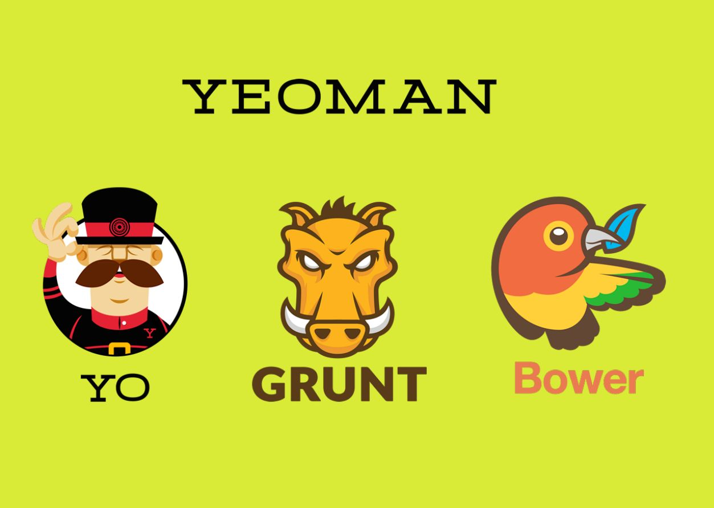

# Yeoman

要启动一个项目，最先要做什么？当然是搭建一个目录结构，新建一个带项目名字的文件夹，再新建一个app文件夹，里面要有common，css，img ... 对了，还要有test文件夹写单元测试，嗯 ~ 大概长这样子吧


#### File Structure
```
ProjectName/
├── app/
│    ├── src/
│    │    ├── common/
│    │    │    ├── app.js
│    │    │    ├── directives.js
│    │    │    ├── filters.js
│    │    │    ├── services.js
│    │    │    └── controllers.js
│    │    ├── css/
│    │    ├── img/
│    │    ├── js/
│    │    ├── lib/
│    │    └── module/
│    │          ├── header/
│    │          └── footer/
│    │                ├── js/
│    │                └── view/
│    ├── dist/
│    │    ├── css/
│    │    ├── js/
│    │    └── html/
│    └── index.html
│                 
├── test/
│    ├── unit/
│    ├── e2e/
│    └── karma.conf.js
│
├── node_modules/
│
└── package.json
```

**等等！NO！NO！ 我们说好的自动化呢？这样子太low了！**

怎么确定自己的目录结构是合理高效的呢？在团队协作中，（幻想一下）身为架构师的你怎么保证团队立项是合乎规范的呢？那些配置文件呢，也要一个个建立吗？为了解决这么low的行为，这时候 YEOMAN 出现了！


## [Yeoman](http://yeoman.io/)

> The web's scaffolding tool for modern webapps!

#### Yeoman用到的tool?



* the scaffolding tool ([Yo](http://yeoman.io/));
* the build tool ([Gulp](https://gulpjs.com/), [Grunt](https://gruntjs.com/));
* the package manager ([Npm](https://www.npmjs.com/), [Bower](https://bower.io/)).

## 为什么有Yeoman

这里就得提一下前端自动化工具，前端集成解决方案

> 为什么需要自动化工具：减少压缩，编译，单元测试，代码校验，重复且无业务关联的工作

#### 什么是前端集成解决方案？
> * 草根派：解决前端工程的根本问题
> * 学院派：一套包含框架和工具（实现目的和基础），便于开发者快速构建美丽实用（要达到的目的）的web应用程序的工作流，同时这套工作流必须是稳健强壮的

解决哪些前端问题：
1. 开发团队代码风格不统一，	如何强制开发规范
2. 前期开发的组件库如何维护和使用
3. 如何模块化前端项目
4. 服务器部署前必须压缩，检查流如何简化，流程如何完善
5. ...

自动化工具:
* yeoman
* Codekit	
* FIS (baidu)
* spirit (alloyteam)
* ...

> 在web项目立项阶段，使用yeoman来生成项目的文件，代码结构，yeoman自动将最佳实践和工具整合进来，大大加速和方便了我们后续的开发

## 安装，Yeoman
```
$ npm install -g yo
```
&
```
$ npm install -g bower
$ npm install -g grunt-cli gulp-cli
```


## Generator又是什么? 为什么要有他? 怎么使用?

> yeoman是一个脚手架生成工具。
  yeoman generator则是yeoman的精髓所在。
  yeoman就是一个工具外壳，它定制了如何调用generator，给generator提供了运行环境。yeoman generator则是解耦出来的核心部分，负责完成一个脚手架应该做的事。
  线上已经有很多generator，可以满足我们一大波需求。不过要做到真正灵活，完全符合自己的需求、业务中的需要就要自己自定义generator了。

安装使用
```
$ npm install -g generator-webapp
$ yo webapp
```

## 怎样[创建Generator](http://yeoman.io/authoring/index.html)?

> yeoman的强大之处在于它提供了一套非常强大的编写自定义generator的API，而且上手非常容易。只要按照特定的约束，很快就可以定制一套自己的generator.

* [yeoman-generator 入门教程](https://segmentfault.com/a/1190000005827971#articleHeader2)

---
## 合伙买个法拉利可好


